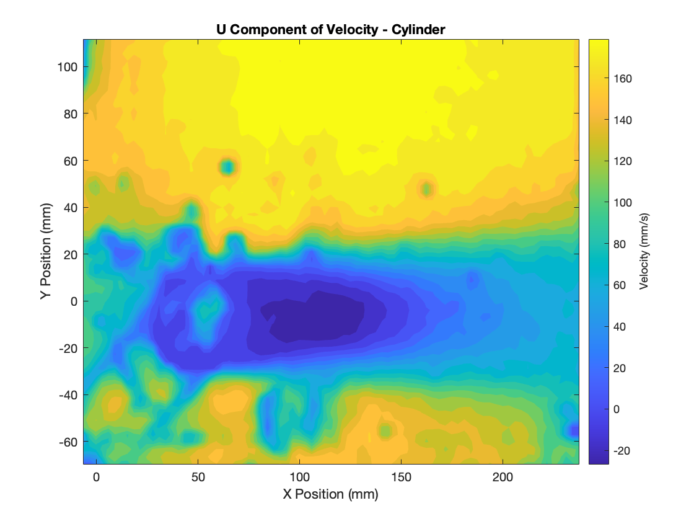

# Particle Image Velocimetry (PIV) Analysis in a Water Tunnel  

## Description  
This MATLAB script processes Particle Image Velocimetry (PIV) data collected in a water tunnel experiment. The analysis includes:  
1. **Velocity Field Visualization** for a cylinder and ONERA M6 wing.  
2. **Velocity Profiles** at specific locations (upstream, downstream).  
3. **Drag Coefficient Calculation** using control volume analysis.  
4. **Contour Plots** for mean velocity components and magnitude.  

---

## Outputs  

### 1. Mean Velocity Field Visualization  
Quiver plots of the mean velocity vectors for the cylinder and ONERA M6 wing at different angles of attack (AOA).  

---

### 2. Velocity Profiles  
Smoothed velocity profiles at upstream and downstream locations.  

---

### 3. Contour Plots  

#### U-Component of Velocity  
Contour plot showing the horizontal velocity field (U).  

#### V-Component of Velocity  
Contour plot showing the vertical velocity field (V).  

#### Velocity Magnitude  
Overall velocity magnitude computed from U and V components.  

---

### 4. Drag Coefficient Analysis  
Drag coefficients are calculated using control volume analysis and plotted alongside the mean velocity field.  

---

